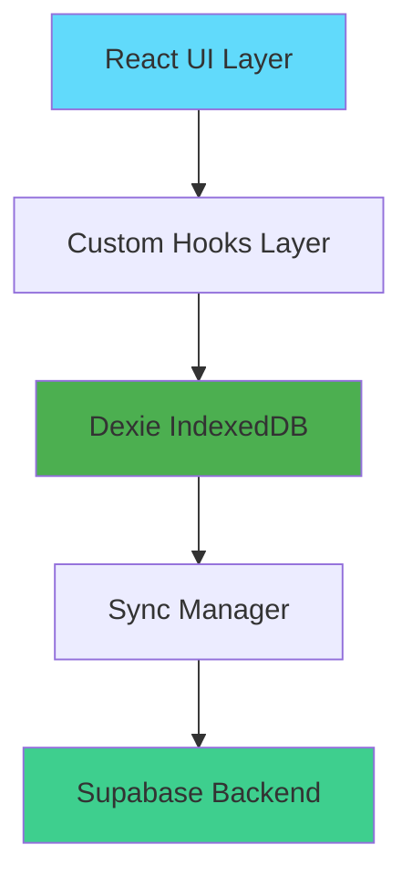
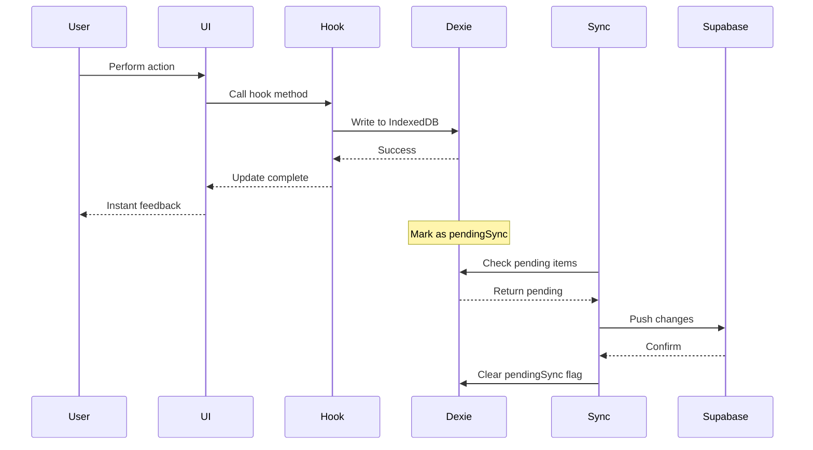
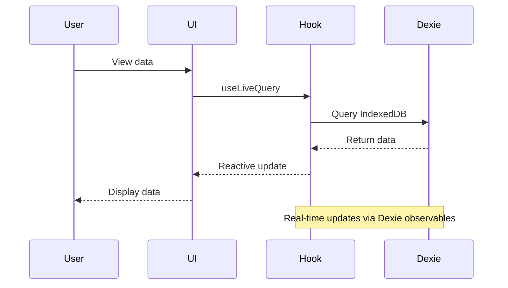
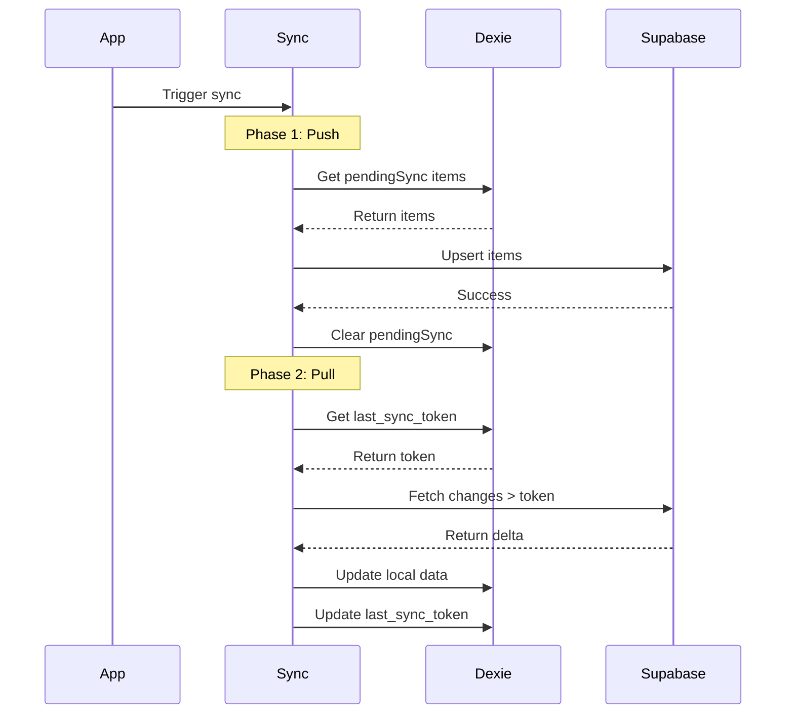
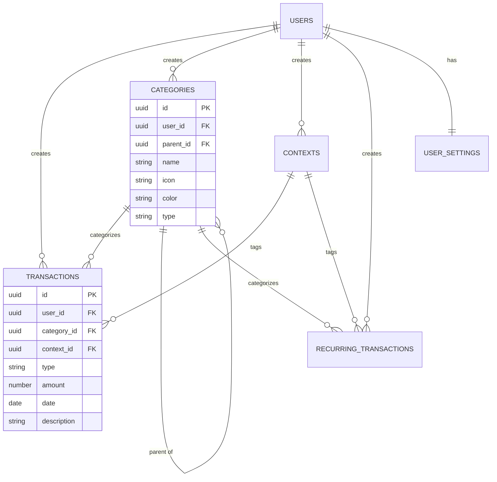

# Architecture Guide

This document provides a detailed technical overview of the Personal Expense Tracker PWA architecture, design patterns, and implementation details.

## 🎉 What's New in v0.7.0

### User Identity System (Public Profiles)
- **`public.profiles` table** with automatic user creation trigger
- Display **names and avatars** instead of raw UUIDs in group members
- Row Level Security (RLS): SELECT for all, INSERT/UPDATE only for owner
- Synchronized across devices with `profiles` table in IndexedDB
- **Hooks**: `useProfiles(userIds)` and `useProfile(userId)`
- **Component**: `<UserAvatar>` for consistent user display

### Hybrid Sync Strategy
- **Restored Supabase Realtime** - Instant cross-device updates
- **Push-only sync** when device comes online
- **Manual refresh buttons** on all data pages (Groups, etc.)
- **Pending Changes Indicator** with badge in header
- **Visual feedback** for unsynced changes
- **Debounced online events** (300ms) to prevent spam

### Collapsible Sidebar (Desktop)
- **shadcn/ui Sidebar component** with icon-only collapsed state
- **Persistent state** (stored in cookie)
- **Keyboard shortcut**: <kbd>Cmd/Ctrl</kbd> + <kbd>B</kbd>
- **Mobile**: Sheet overlay (unchanged)
- **Desktop**: Smooth collapse animation

### iOS Safe Area Support
- **viewport-fit=cover** for full-screen PWA
- **`env(safe-area-inset-*)` CSS variables** for notch/Dynamic Island
- Safe area padding on `SidebarInset` root container
- Perfect support for all iPhone models (including Pro Max)

### Database Schema Updates
- **`profiles` table** (id, email, full_name, avatar_url)
- Consolidated SQL: all new migrations in `supabase_schema.sql`
- Dexie schema v4 with `profiles` table
- `check_user_exists(uuid)` RPC function for member validation

### UI Improvements
- Fixed chart Y-axis legend spacing (Dashboard, Statistics)
- Better mobile layout with flip cards
- Improved category budgets integration
- Context tagging in transaction forms

### Bug Fixes
- **Monthly budget sync** now works correctly (epoch 0 default settings)
- **iOS content overlap** resolved with safe area
- **Group member list** updates reactively after adding members
- **Async status methods** in SyncManager (no more race conditions)

## Table of Contents

- [System Architecture](#system-architecture)
- [Offline-First Architecture](#offline-first-architecture)
- [Data Flow](#data-flow)
- [Database Schema](#database-schema)
- [Synchronization Strategy](#synchronization-strategy)
- [Component Architecture](#component-architecture)
- [State Management](#state-management)
- [PWA Implementation](#pwa-implementation)
- [Internationalization](#internationalization)

## System Architecture

### High-Level Overview

The application follows an **offline-first architecture** where all data operations happen locally first, then sync to the cloud when connectivity is available.



### Architecture Layers

1. **Presentation Layer** - React components and pages
2. **Business Logic Layer** - Custom hooks for data operations
3. **Data Access Layer** - Dexie for IndexedDB operations
4. **Synchronization Layer** - Sync manager for cloud sync
5. **Backend Layer** - Supabase (PostgreSQL + Auth)

## Offline-First Architecture

### Core Principles

1. **Local-First Operations**: All CRUD operations write to IndexedDB immediately
2. **Optimistic Updates**: UI updates instantly without waiting for server
3. **Background Sync**: Changes sync to Supabase when online
4. **Conflict Resolution**: Server state always wins (last-write-wins with sync tokens)

### Why Offline-First?

- **Performance**: Instant UI updates, no network latency
- **Reliability**: Works without internet connection
- **User Experience**: No loading spinners for basic operations
- **Data Ownership**: User data stored locally first

## Data Flow

### Write Operations (Create/Update/Delete)



### Read Operations



### Sync Operations



## Database Schema

### IndexedDB Schema (Dexie)

The local database uses Dexie.js as a wrapper around IndexedDB.

#### Transactions Table

```typescript
interface Transaction {
  id: string; // UUID
  user_id: string; // User identifier
  category_id: string; // Required category reference
  context_id?: string; // Optional context reference
  type: "income" | "expense" | "investment";
  amount: number; // Transaction amount
  date: string; // ISO date string
  year_month: string; // Computed: YYYY-MM for indexing
  description: string; // Transaction description
  deleted_at?: string; // Soft delete timestamp
  pendingSync?: number; // 1 if needs sync, 0 if synced
  sync_token?: number; // Server sync token
}

// Indexes: id, user_id, category_id, context_id, type, date, year_month, pendingSync, deleted_at
```

#### Categories Table

```typescript
interface Category {
  id: string;
  user_id: string;
  name: string;
  icon: string; // Lucide icon name
  color: string; // Tailwind color name
  type: "income" | "expense" | "investment";
  parent_id?: string; // For hierarchical categories
  active: number; // 1 or 0 (boolean)
  deleted_at?: string;
  pendingSync?: number;
  sync_token?: number;
}

// Indexes: id, user_id, type, pendingSync, deleted_at
```

#### Contexts Table

```typescript
interface Context {
  id: string;
  user_id: string;
  name: string;
  description?: string;
  active: number;
  deleted_at?: string;
  pendingSync?: number;
  sync_token?: number;
}

// Indexes: id, user_id, pendingSync, deleted_at
```

#### Recurring Transactions Table

```typescript
interface RecurringTransaction {
  id: string;
  user_id: string;
  type: "income" | "expense" | "investment";
  category_id: string;
  context_id?: string;
  amount: number;
  description: string;
  frequency: "daily" | "weekly" | "monthly" | "yearly";
  start_date: string;
  end_date?: string;
  active: number;
  last_generated?: string; // Last time transactions were generated
  deleted_at?: string;
  pendingSync?: number;
  sync_token?: number;
}

// Indexes: id, user_id, type, frequency, pendingSync, deleted_at
```

#### User Settings Table

```typescript
interface Setting {
  user_id: string; // Primary key
  currency: string; // e.g., 'EUR', 'USD'
  language: string; // e.g., 'en', 'it'
  theme: string; // 'light', 'dark', 'system'
  accentColor: string; // Tailwind color name
  start_of_week: string; // 'monday' or 'sunday'
  default_view: string; // 'list' or 'grid'
  include_investments_in_expense_totals: boolean;
  include_group_expenses: boolean; // Include group expenses in personal totals
  monthly_budget?: number; // Monthly spending limit
  cached_month?: number; // Currently cached month for statistics
  last_sync_token?: number; // Last synced token
  updated_at?: string;
}

// Primary key: user_id
```

#### Category Budgets Table

```typescript
interface CategoryBudget {
  id: string; // UUID
  user_id: string; // User identifier
  category_id: string; // Reference to category
  amount: number; // Budget limit amount
  period: "monthly" | "yearly"; // Budget period
  deleted_at?: string | null; // Soft delete timestamp
  pendingSync?: number; // 1 if needs sync
  sync_token?: number; // Server sync token
  updated_at?: string;
  created_at?: string;
}

// Indexes: id, user_id, category_id, period, pendingSync, deleted_at
```

#### Groups Table

```typescript
interface Group {
  id: string; // UUID
  name: string; // Group name
  description?: string; // Optional description
  created_by: string; // User who created the group
  deleted_at?: string; // Soft delete timestamp
  pendingSync?: number;
  sync_token?: number;
  updated_at?: string;
  created_at?: string;
}

// Indexes: id, created_by, deleted_at
```

#### Group Members Table

```typescript
interface GroupMember {
  id: string; // UUID
  group_id: string; // Reference to group
  user_id: string; // Reference to user
  share: number; // 0-100 percentage
  joined_at?: string;
  removed_at?: string; // Soft removal timestamp
  pendingSync?: number;
  sync_token?: number;
  updated_at?: string;
}

// Indexes: id, group_id, user_id
```

#### Profiles Table (v0.6.1)

```typescript
interface Profile {
  id: string; // UUID (FK to auth.users)
  email: string; // User email
  full_name?: string; // Display name
  avatar_url?: string; // Avatar image URL
  updated_at?: string; // Last update timestamp
  sync_token?: number; // Server sync token
}

// Indexes: id
// Note: This table is public and readable by all authenticated users
// Users can only INSERT/UPDATE their own profile
```

### Supabase Schema (PostgreSQL)

The Supabase schema mirrors the IndexedDB schema with additional features:

- **Row Level Security (RLS)**: Users can only access their own data
- **Triggers**: Automatically update `sync_token` and `updated_at` on changes
- **Foreign Keys**: Enforce referential integrity
- **Sequences**: Global sync token sequence for delta sync

See [supabase_schema.sql](file:///Users/ilariopc/Code/react/pwa-antigravity/supabase_schema.sql) for the complete schema.

### Entity Relationships



## Synchronization Strategy

### Delta Sync with Sync Tokens

The app uses **delta synchronization** to minimize data transfer and improve performance.

#### How It Works

1. **Sync Token**: Each table row has a `sync_token` (incrementing integer)
2. **Last Sync Token**: Client stores the last synced token in `user_settings`
3. **Delta Query**: Client requests only rows with `sync_token > last_sync_token`
4. **Update Local**: Client updates local database with delta
5. **Update Token**: Client updates `last_sync_token` to the highest received token

#### Sync Manager Implementation

Located in [src/lib/sync.ts](file:///Users/ilariopc/Code/react/pwa-antigravity/src/lib/sync.ts):

```typescript
class SyncManager {
  async sync() {
    await this.pushPending(userId); // Push local changes
    await this.pullDelta(userId); // Pull server changes
  }

  private async pushPending(userId: string) {
    // Find all items with pendingSync = 1
    // Upsert to Supabase
    // Clear pendingSync flag on success
  }

  private async pullDelta(userId: string) {
    // Get last_sync_token from settings
    // Query Supabase for sync_token > last_sync_token
    // Update local IndexedDB
    // Update last_sync_token
  }
}
```

#### Conflict Resolution

- **Strategy**: Last-write-wins (server state wins)
- **Rationale**: Single-user app, conflicts are rare
- **Future**: Could implement CRDTs for multi-device scenarios

### Hybrid Sync Strategy (v0.7.0)

The app uses a **hybrid sync strategy** that combines the reliability of offline-first storage with the immediacy of realtime updates:

**Core Principles**:
1.  **Local-First**: All writes go to IndexedDB first.
2.  **Push on Online**: Pending changes are pushed to Supabase when the device comes online.
3.  **Realtime Listeners**: The app listens for changes from other devices via Supabase Realtime.
4.  **Manual Refresh**: Users can explicitly pull the latest data.

**How It Works**:

```typescript
// 1. User makes changes → Write to IndexedDB + mark pendingSync
await db.transactions.add({ ...data, pendingSync: 1 });

// 2. When online → Auto-push pending changes
window.addEventListener('online', () => {
  syncManager.sync(); // Pushes pendingSync items
});

// 3. Realtime → Listen for remote changes
useRealtimeSync(); // Subscribes to Supabase changes and updates IndexedDB
```

**Benefits**:
-   ✅ **Instant Updates**: See changes from other devices immediately.
-   ✅ **Offline Reliability**: Works perfectly without internet.
-   ✅ **Battery Efficient**: Realtime connection is managed intelligently.

**Realtime Implementation**:
-   `useRealtimeSync` hook manages subscriptions.
-   Updates are written to IndexedDB, triggering reactive UI updates via `useLiveQuery`.
-   Last-write-wins conflict resolution based on `updated_at`.

### Sync Triggers

Synchronization happens in multiple scenarios with optimizations to prevent redundant operations:

1. **Auto Sync on Startup**: Initial sync triggered 2 seconds after app load (non-blocking)
   - Uses `useSync` hook in `ProtectedRoute`
   - Delay allows instant UI rendering with cached data
   - Cancels if online event triggers sync earlier (prevents race condition)

2. **Auto Sync on Online**: When app detects internet connection restored
   - Uses `useOnlineSync` hook with 300ms debouncing
   - Prevents spam on unstable networks
   - Cancels startup sync if triggered within first 2 seconds

3. **Manual Sync**: User clicks sync button in settings
   - Uses `safeSync()` wrapper to prevent concurrent syncs
   - Provides immediate feedback to user

4. **Full Sync**: User requests complete re-sync from server
   - Ignores `last_sync_token`
   - Downloads all data fresh
   - Useful for troubleshooting sync issues

### Sync Optimizations (v0.5.3)

Recent optimizations improve reliability and performance:

- **Race Condition Prevention**: Startup sync cancels if online event triggers sync
- **Debouncing**: 300ms for online events, 1s for offline events
- **Safe Sync Wrapper**: `safeSync()` prevents concurrent sync operations
- **Memory Leak Prevention**: Proper cleanup of session expiration timers
- **Single Sync on Startup**: Removed duplicate sync from `useAutoGenerate`

### Cache-First Authentication

The app implements cache-first authentication for instant startup:

1. **Immediate Rendering**: Shows cached user without waiting for Supabase
2. **Background Validation**: Validates session in background (non-blocking)
3. **Session Expiration**: Shows toast with 5-second countdown if session expired
4. **Graceful Degradation**: Falls back to cached user on network errors

```typescript
// useAuth implementation
- Show cached user immediately (< 100ms)
- Validate session in background
- Update UI only if session changed/expired
```

This provides **~30x faster** startup compared to waiting for network validation.

## Component Architecture

### Component Hierarchy

```
App
├── ThemeProvider
├── Router
│   ├── AuthPage (public)
│   └── ProtectedRoute
│       └── AppShell
│           ├── DesktopNav / MobileNav
│           └── Routes
│               ├── Dashboard
│               ├── Transactions
│               ├── RecurringTransactions
│               ├── Categories
│               ├── Contexts
│               ├── Statistics
│               └── Settings
```

### Key Components

#### AppShell

- Provides layout structure
- Renders navigation (mobile/desktop)
- Wraps all authenticated pages

#### CategorySelector

- Complex component for hierarchical category selection
- Desktop: Breadcrumb navigation in popover
- Mobile: Sheet with nested navigation
- Filters by transaction type

#### Categories Page - Hierarchical Display

The Categories page displays unlimited nested categories using recursive components:

```typescript
// Mobile: Collapsible accordion with nested cards
function MobileCategoryList({
  categories,
  depth,
  getChildren,
  ...props
}: CategoryListProps) {
  // Recursive rendering with Radix Collapsible
  // Visual indentation based on depth
  // maxDepth = 5 to prevent infinite recursion
}

// Desktop: Table with expandable rows
function DesktopCategoryRows({
  categories,
  depth,
  getChildren,
  ...props
}: CategoryListProps) {
  // Recursive table rows
  // React.Fragment for valid HTML (no div wrapper in tbody)
  // Visual indentation with paddingLeft
}
```

**Key Implementation Details**:

- **childrenMap**: `Map<string | undefined, Category[]>` for O(1) parent→children lookup
- **rootCategories**: Categories with `parent_id = undefined`
- **expandedCategories**: `Set<string>` tracking which nodes are expanded
- **maxDepth**: Prevents infinite recursion (default: 5 levels)

#### TransactionList

- Displays transactions with virtual scrolling
- Shows sync status indicators
- Supports filtering and sorting

### UI Components (shadcn/ui)

Located in [src/components/ui/](file:///Users/ilariopc/Code/react/pwa-antigravity/src/components/ui/):

- Form components: Button, Input, Select, Switch, etc.
- Layout: Card, Dialog, Sheet, Tabs, ScrollArea
- Feedback: Alert, Toast (Sonner)
- Data: Table, Chart (Recharts integration)

## State Management

### Strategy: Local-First with Reactive Queries

The app uses **Dexie's `useLiveQuery`** for reactive state management:

```typescript
// Automatically re-renders when data changes
const transactions = useLiveQuery(() =>
  db.transactions
    .where("user_id")
    .equals(userId)
    .and((t) => !t.deleted_at)
    .toArray()
);
```

### Benefits

- **No Redux/Zustand needed**: Database is the source of truth
- **Automatic updates**: Components re-render on data changes
- **Optimistic UI**: Changes reflect immediately
- **Simple mental model**: Query database, get reactive data

### Custom Hooks Pattern

Each entity has a custom hook that encapsulates:

1. **Data queries** with `useLiveQuery`
2. **CRUD operations** that write to IndexedDB
3. **Pending sync marking** for offline changes

Example: [useTransactions](file:///Users/ilariopc/Code/react/pwa-antigravity/src/hooks/useTransactions.ts)

## PWA Implementation

### Service Worker

Configured via [vite-plugin-pwa](file:///Users/ilariopc/Code/react/pwa-antigravity/vite.config.ts):

```typescript
VitePWA({
  registerType: "prompt", // User-controlled updates with notification
  workbox: {
    runtimeCaching: [
      {
        // Cache documents, scripts, styles
        urlPattern: ({ request }) =>
          request.destination === "document" ||
          request.destination === "script" ||
          request.destination === "style",
        handler: "NetworkFirst", // Try network, fallback to cache
        options: {
          cacheName: "static-resources",
          expiration: { maxAgeSeconds: 7 * 24 * 60 * 60 },
        },
      },
      {
        // Cache images
        urlPattern: ({ request }) => request.destination === "image",
        handler: "CacheFirst", // Use cache, update in background
        options: {
          cacheName: "images",
          expiration: { maxAgeSeconds: 30 * 24 * 60 * 60 },
        },
      },
    ],
  },
});
```

### PWA Update Strategy

The app uses `registerType: "prompt"` for user-controlled updates:

1. **Detection**: Service worker checks for updates every hour
2. **Notification**: When update available, `usePWAUpdate` hook sets `needRefresh: true`
3. **User Choice**: `PWAUpdateNotification` component shows toast with options:
   - **Reload**: Apply update immediately
   - **Later**: Dismiss notification (update applies on next visit)
4. **Offline Ready**: Shows success toast when app is cached for offline use

```typescript
// usePWAUpdate hook provides:
const { needRefresh, offlineReady, updateServiceWorker, close } =
  usePWAUpdate();
```

### Caching Strategies

- **NetworkFirst**: For HTML, CSS, JS - Fresh content when online
- **CacheFirst**: For images - Fast loading, update in background

### Manifest

PWA manifest defines:

- App name and icons
- Display mode: `standalone` (no browser UI)
- Theme colors
- Start URL

### iOS Compatibility

Special meta tags in [index.html](file:///Users/ilariopc/Code/react/pwa-antigravity/index.html):

```html
<meta
  name="viewport"
  content="width=device-width, initial-scale=1.0, maximum-scale=1.0, user-scalable=no"
/>
<meta name="apple-mobile-web-app-capable" content="yes" />
<meta name="apple-mobile-web-app-status-bar-style" content="default" />
```

## Internationalization

### i18n Setup

Using [i18next](file:///Users/ilariopc/Code/react/pwa-antigravity/src/i18n.ts):

```typescript
i18n
  .use(LanguageDetector) // Auto-detect browser language
  .use(initReactI18next) // React integration
  .init({
    resources: {
      en: { translation: enTranslation },
      it: { translation: itTranslation },
    },
    fallbackLng: "en",
  });
```

### Translation Files

Located in [src/locales/](file:///Users/ilariopc/Code/react/pwa-antigravity/src/locales/):

```
locales/
├── en/
│   └── translation.json
└── it/
    └── translation.json
```

### Usage in Components

```typescript
import { useTranslation } from "react-i18next";

function MyComponent() {
  const { t } = useTranslation();
  return <h1>{t("dashboard.title")}</h1>;
}
```

### Language Switching

User can change language in Settings, which updates:

1. `i18n.changeLanguage()`
2. Local storage (persisted)
3. User settings in database

## Performance Optimizations

### IndexedDB Indexing

Strategic indexes on frequently queried fields:

- `year_month` for monthly transaction queries
- `type` for filtering by transaction type
- `pendingSync` for sync operations
- `deleted_at` for soft delete filtering

###  Virtual Scrolling

Large lists use `ScrollArea` for performance with many items.

### Memoization

Statistics calculations use `useMemo` to avoid recalculation:

```typescript
const monthlyTotals = useMemo(() => {
  // Expensive calculation
  return calculateTotals(transactions);
}, [transactions]);
```

### Code Splitting

React Router automatically code-splits routes for faster initial load.

### Auth & Sync Optimizations (v0.5.3)

**Cache-First Authentication**:
- Instant app startup (< 100ms) using cached credentials
- Background session validation (non-blocking)
- ~30x faster compared to network-first approach

**Smart Sync**:
- 2-second delay on startup prevents blocking UI
- 300ms debouncing on online events prevents spam
- Race condition prevention between multiple sync triggers
- `safeSync()` wrapper prevents concurrent operations
- Removed duplicate sync triggers (-66% sync operations)

**Memory Management**:
- Proper timer cleanup in session expiration flow
- No memory leaks on page reload/navigation

## Security Considerations

### Row Level Security (RLS)

Supabase policies ensure data isolation:

```sql
create policy "Users can view their own transactions"
    on public.transactions for select
    using (auth.uid() = user_id);
```

### Authentication

- Supabase Auth handles authentication
- JWT tokens stored securely
- Protected routes check auth state

### Data Validation

- TypeScript provides compile-time type safety
- Database constraints enforce data integrity
- Form validation prevents invalid input

## Future Enhancements

Potential architectural improvements:

1. **Optimistic Conflict Resolution**: Implement CRDTs for better multi-device sync
2. **Background Sync API**: Use service worker for periodic sync
3. **Incremental Sync**: Sync only changed fields, not entire rows
4. **Compression**: Compress sync payloads for large datasets
5. **Encryption**: End-to-end encryption for sensitive data

---

This architecture provides a solid foundation for a reliable, performant, offline-first financial tracking application.
